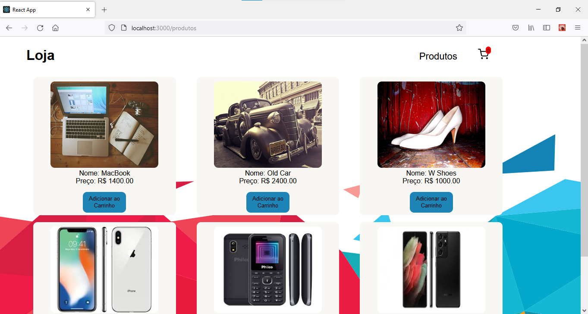
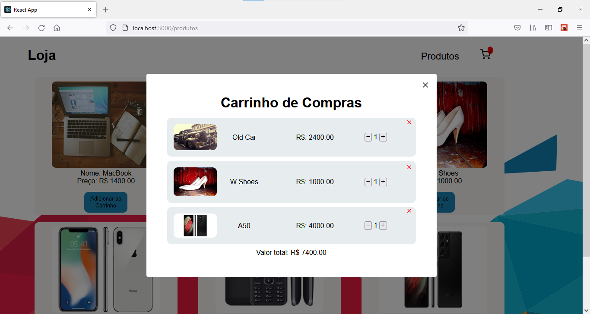

<h1 align="center">
  
</h1>

<h1 align="center">Loja</h1>

  

  

  

  

 

## 💻 Projeto

Projeto de um carrinho de compras feito em ReactJS com TypeScript. O principio de um carrinho
de compra foi feito com Modal, contexto e styled-components. 

 

## 🌐 Preview

<h1 align="center">
    
    
</h1>

## 🚀 Tecnologias

Esse projeto foi desenvolvido com as seguintes tecnologias:

- [React](https://reactjs.org)
- [Typescript](https://www.typescriptlang.org/)
- [Styled Components](https://styled-components.com/)
- [Context](https://pt-br.reactjs.org/docs/context.html)
- [Modal](https://www.npmjs.com/package/react-modal)

 

  Made with 💙 by <a href="https://www.linkedin.com/in/natan-xavier-a266a0228/"> Natan Xavier </a>

